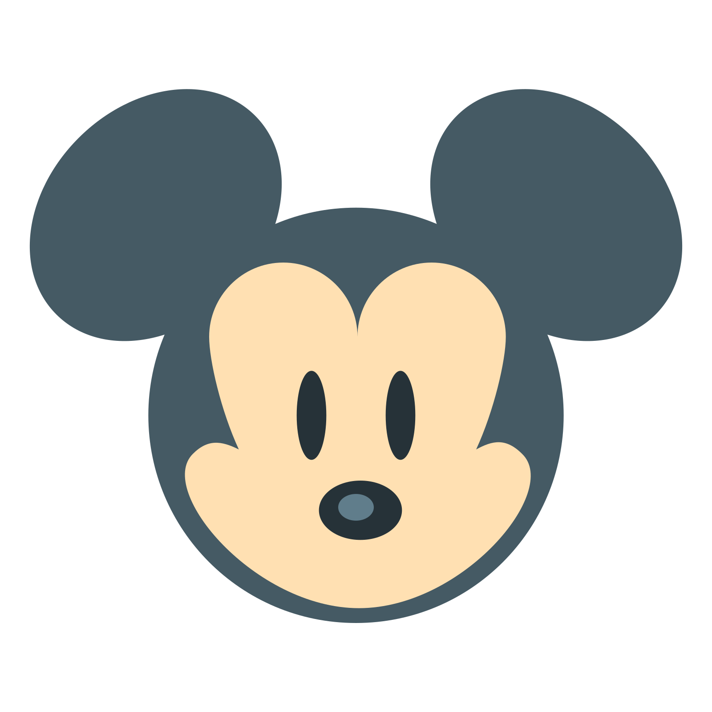

# Word-Guess
Disney Guess-The-Movie Game

This game is based on Disney movies,
All you have to do is:

-Press any key to get started!

-Wins: (# of times user guessed the movie correctly).

For example: 

-If the movie is Aladdin, the game displays it at its start: _ _ _ _ _ _ _.

-As the user guesses the correct letters, reveal them: a l a d _ _ n.

-Number of Guesses Remaining: (# of guesses remaining for the user).

-Letters Already Guessed: (Letters the user has guessed, displayed like L Z Y H).

-After the user wins/loses the game will automatically choose another movie and make the user play it.

Click MICKEY to play!!!

